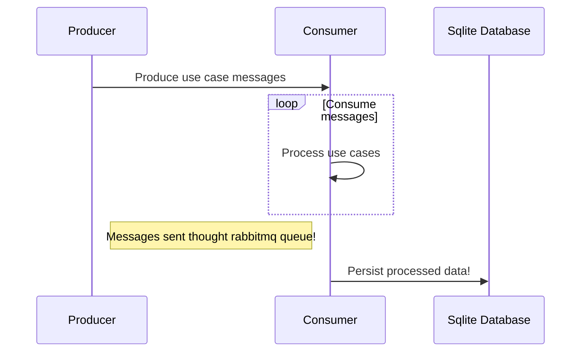

# go-usecases

A simple golang app that implements simple orders use cases.

## Requirements

To run this this project, you'll need to have installed:

- [sqlite3](https://www.sqlite.org/download.html)
- [Docker desktop](https://docs.docker.com/engine/install/) or [Colima (I'm using this one)](https://github.com/abiosoft/colima)
- [Docker compose](https://docs.docker.com/compose/install/)
- [Golang 1.18 or higher](https://go.dev/doc/install)

## How to setup the project

This command will create the local database called `orders.db` and install the git hooks.

```shell
make setup
```

## Project overview

This project was build based in a series of three videos from and event called `go intensivo`, here are the videos if you want to watch them:

- [First video](https://youtu.be/rzDF3xkI5_w)
- [Second video](https://youtu.be/4yNdsgUTQNw)
- [Third video](https://youtu.be/x1q-FsIS30s)

### Project diagram



## How to run tests

```shell
make tests
```

## How to run the project

```shell
make run
```
